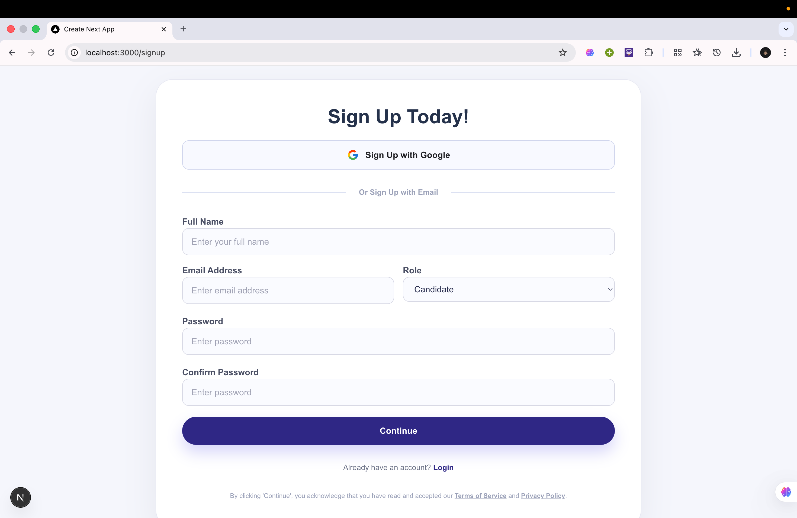
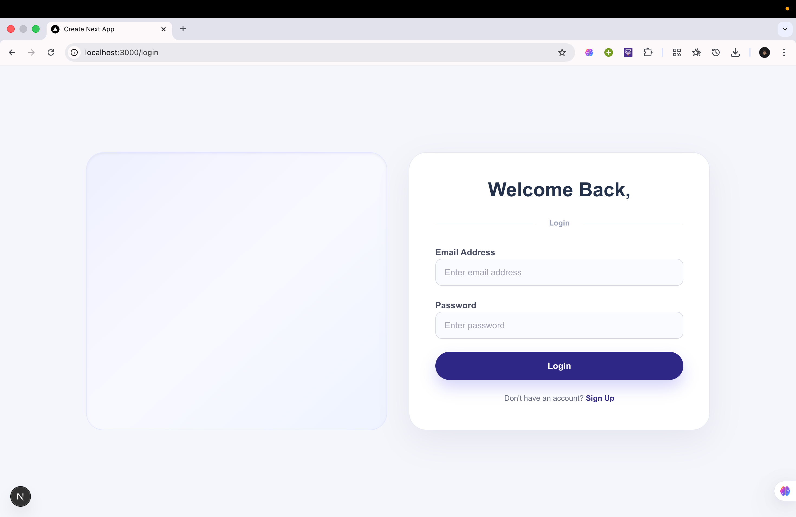
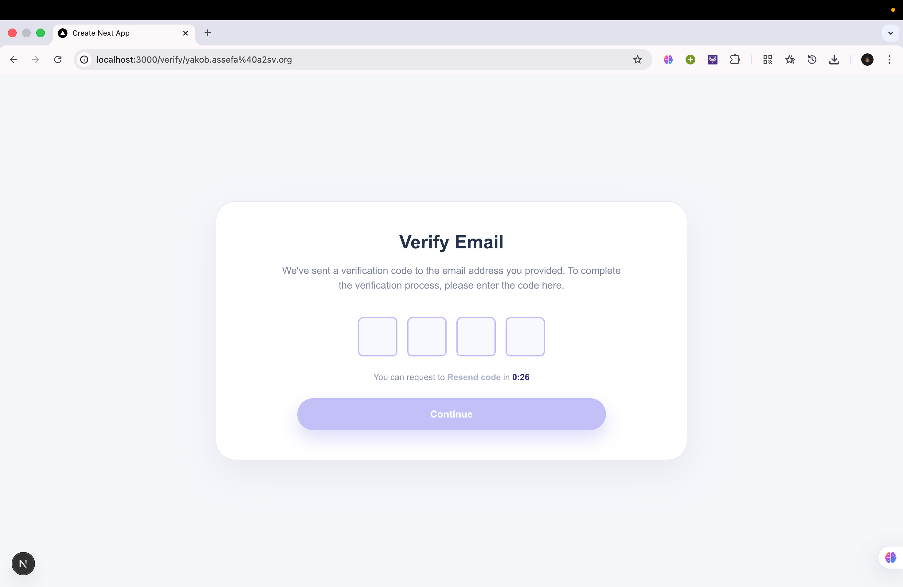
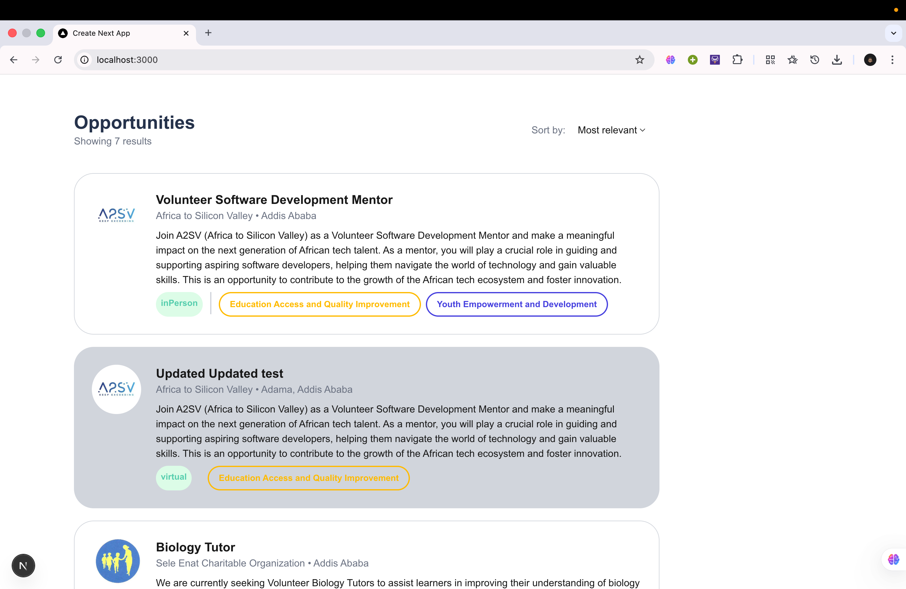

# Job Listing App – Auth Update

I added the missing auth flows and cleaned up the UX to match the provided mockups. This is what changed:

- Built dedicated pages for **Sign Up**, **Login**, and **Verify Email** with the reference styling (rounded CTAs, centered cards, soft purple palette).
- Wired the forms to the live backend: `/signup`, `/login`, `/verify-email`, and `/verify-email/resend`.
- Added inline validation (empty fields, password confirmation, OTP length) plus success/error banners for clearer feedback.
- Store the access token from login in `localStorage` so follow-up calls can reuse it.
- Fixed Next 16 `params` handling in the verify page by unwrapping the promised `params` with `use()`.

## How to run

```bash
npm install
npm run dev
```
Then open `http://localhost:3000` and navigate to `/signup`, `/login`, or the verification link the signup flow uses (`/verify/<email>`).

## API assumptions

- Base URL: `https://akil-backend.onrender.com`
- Signup body: `{ name, email, password, confirmPassword, role }`
- Login body: `{ email, password }`
- Verify body: `{ email, OTP }`
- Resend: POST `/verify-email/resend` with `{ email }` (update if your backend expects a different path).

## Screen Shots



